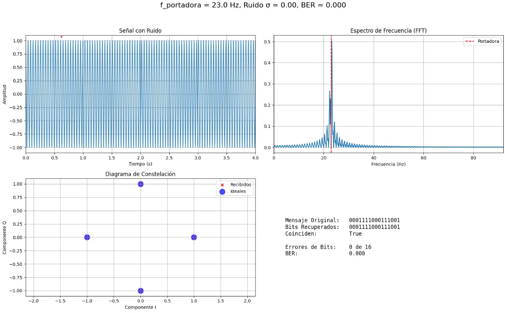

# From Fourier to QPSK: Practical Simulation of Digital Modulation

Este proyecto presenta una introducción práctica a la **modulación digital QPSK** utilizando conceptos de **Series de Fourier**, pilares fundamentales en telecomunicaciones modernas como Wi-Fi, 4G/5G y radio digital. A través de un Jupyter Notebook interactivo, exploramos cómo los ingenieros transforman datos digitales en señales analógicas capaces de viajar a través del espacio.


## Objetivos
- Comprender la relevancia práctica de las Series de Fourier en telecomunicaciones.
- Implementar un sistema de transmisión digital usando modulación **QPSK**.
- Visualizar y analizar las señales en el dominio del tiempo y la frecuencia.

##  Tecnologías Utilizadas
- Python 3
- Numpy
- Matplotlib
- Scipy

##  Contenidos
1. **Introducción a Fourier y señales sinusoidales**
2. **Concepto de modulación digital**
3. **Implementación de modulación QPSK**
4. **Demodulación y reconstrucción de datos**
5. **Visualización de señales y espectros**
6. **Aplicaciones prácticas en telecomunicaciones**

## Publico objetivo

Estudiantes de Ingeniería en Sistemas de la Universidad Nacional de La Rioja (UNLaR), particularmente en el curso de Análisis Matemático III. Dictada por el ingeniero Laffit

## Observa en tiempo real cómo afectan a la señal, su espectro, la constelación y la tasa de error (BER)




## 🚀 Cómo Ejecutarlo
1. Clona este repositorio:
   ```bash
   git clone https://github.com/tu_usuario/Fourier-QPSK-Simulation.git